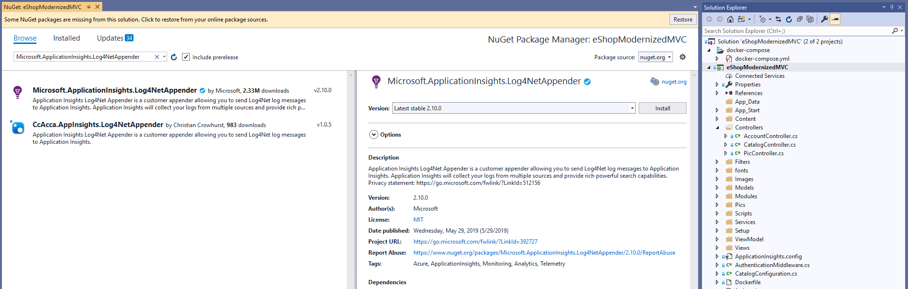

# ASP.NET Lift & Shift Workshop  

## Workshop Overview 

In this workshop, we will be taking an older ASP.NET WebForms application and modernizing it so that it can be deployed to Azure AppService.  The activities that you will perform during this workshop align with common scenarios encountered while working with customers.  The following app modernization activities should be performed sequentially. 

- [Initial Setup](#initial-setup)
- [Configuration](#configuration)
- [Logging](#logging)
- [Session](#session)

The following section is supplementary and may require elevated permissions within your subscription. If you plan to complete these as part of the workshop, please note the requirements in the respective sections prior to beginning the lab.

- [Managed Identity](#managed-identity)


## Initial Setup

In order to walkthrough the process of migrating an ASP.NET application to Azure AppSevice, we will be using the eShopModernizing project available on GitHub. This project has a sample of a WCF, ASP.NET WebForms, and ASP.NET MVC project with a before (marked as legacy) and after (marked as modernized). We will focus on modernizing the WebForms in the walkthrough, but the sample has both of the ASP.NET applications updated to use the more cloud ready patterns discussed in the walkthrough. 

For this part of the workshop, we will be using the Azure CLI from the Azure Cloud Shell to provision resources.  Log into the Azure Portal and open the Azure Cloud shell and choose Bash to begin.   


If this is the first time you have used the Azure Cloud Shell, you will be prompted to select your Azure Subscription to allow it to create a storage account for the shell. 

The following Azure CLI commands will set up the initial AppService and SQL server that will be used to deploy to Azure. Many Azure resource names are required to be globally unique, so you'll use your Microsoft alias to generate unique names.

Start by creating a variable with your alias - make sure it is lower case and you do not use any dashes or underlines in your alias name.

```bash
msftalias="yourmsftalias"
```

Now copy/paste in the rest of the variables you'll use in this workshop:

```bash
location="eastus" \
resourcegroupname="$msftalias-workshop-group" \
webappname="$msftalias-workshop-webapp" \
serveradminname="ServerAdmin" \
serveradminpassword="ChangeYourAdminPassword1" \
servername="$msftalias-workshop-server" \
dbname="eShop" \
storageaccountname="${msftalias}workshopstorage" \
storagecontainername="workshopcontainer" \
appinsightsname="$msftalias-workshop-insights" \
rediscachesname="$msftalias-workshop-cache" \
adminuser="anyAdminUserName"
```

Now that the variables are set, use Azure CLI to create a resource group.  Resource groups are a logical container into which Azure resources like web apps, databases, and storage accounts are deployed and managed. 

> You can verify the commands have completed successfully by browsing to the resource group in the Azure Portal after they complete.

```bash
az group create --resource-group $resourcegroupname --location $location 
```

Next create an App Service Plan and a Web App.  An App Service plan specifies the location, size, and features of the web server farm that hosts your app. 

```bash
az appservice plan create --resource-group $resourcegroupname --name $webappname
```

```bash
az webapp create --resource-group $resourcegroupname --name $webappname --plan $webappname 
```

```bash
az webapp identity assign --resource-group $resourcegroupname --name $webappname 
```

Using the following commands, create a SQL Database server, add a firewall rule to allow access from other Azure service, and create a SQL database. 

```bash
az sql server create --resource-group $resourcegroupname --location $location --name $servername --admin-user $serveradminname --admin-password $serveradminpassword 
```

```bash
az sql server firewall-rule create --resource-group $resourcegroupname --server $servername --name AllowAzureServices --start-ip-address 0.0.0.0 --end-ip-address 0.0.0.0 
```

```bash
az sql db create --resource-group $resourcegroupname --server $servername --name $dbname --service-objective S0 
```


## Configuration

In this walkthrough, we will look at updating the .NET configuration system to take advantage of ConfigurationBuilders, why it matters, and how to use them to easily pull secrets from Azure KeyVault. Launch Visual Studio 2019 and open the eShopLegacyWebForms solution to begin.

### Background 

Configuration is central to customizing many applications. This allows setting connection strings or options in a way that does not require recompiling the application. Benefits of this include being able to change behavior in a production environment, or having different settings depending on the runtime environment, such as region deployment or testing slots. In .NET Framework applications, the built in and most common mechanism to customize an application is via the ConfigurationManager type. These are often set in the app.config file for desktop applications or web.config for ASP.NET applications. Historically, this was the only source that the ConfigurationManager knew about; however, with the release of .NET 4.7.1, it was updated to know about an extensible mechanism called ConfigurationBuilders that allow for composition of configuration sources. 

By expanding the available sources for ConfigurationManager instances, an application can now bring in settings from whatever makes the most sense. When settings could only be set in app.config or web.config, it was easy to start committing secrets into the versioning system which greatly increases the risk of the secrets leaking. With ConfigurationBuilders, the secrets that need to be kept confidential can be stored in a secure location (such as Azure Key Vault), while the other settings can be pulled from sources that make the most sense, be it environment variables, AppService settings, or a file. 

The .NET Framework itself provides a framework from which other ConfigurationBuilders can be developed but doesn’t include any out of the box. In order to make use of this system, custom builders must be built, or can be chosen from those maintained here: https://github.com/aspnet/MicrosoftConfigurationBuilders.  

Supported configuration builders include: 

- Microsoft.Configuration.ConfigurationBuilders.Environment – Adds settings from the environment variables of the current process
- Microsoft.Configuration.ConfigurationBuilders.UserSecrets - User secrets contained in an XML file external to the code base
- Microsoft.Configuration.ConfigurationBuilders.Azure - Pulls items from key vault
- Microsoft.Configuration.ConfigurationBuilders.KeyPerFile - File based where the name of the file is the key and the contents are the value
- Microsoft.Configuration.ConfigurationBuilders.Json - Pulls key/value pairs from JSON files 

The choice as to which one should be used depends on the scenarios and data stores of an individual application. At the time of writing, v2 of these ConfigurationBuilders is still in pre-release, but brings enough features that simplify deployment to the cloud that this walkthrough will be using those. They are planned to RTM for v2 soon. 

### Add ConfigurationBuilders to the project


The first thing that needs to be done in order to enable ConfigurationBuilders is to install the builder via NuGet. Since we will be using a prerelease version, if you use the GUI in Visual Studio, you’ll need to check the “Allow Prerelease”. The following needs to be installed (the Package Manager commands will be shown, but these packages can be added via the GUI as well): 

```
Install-Package Microsoft.Configuration.ConfigurationBuilders.Environment -Version 2.0.0-beta 

Install-Package Microsoft.Configuration.ConfigurationBuilders.Azure -Version 2.0.0-beta 

Install-Package Microsoft.Configuration.ConfigurationBuilders.UserSecrets -Version 2.0.0-beta 
```

This will update the web.config file to add a ConfigSection for configBuilders, wherein three builders are registered. One is for the environment variables, named Environment, another is for KeyVault, named AzureKeyVault, and the final is for user defined secrets called Secrets.

Make the following modifications to the `web.config` so that the configuration builders are hooked up correctly:

1. Change the `vaultName` in the `AzureKeyVault` entry to `${KeyVaultName}`. This allows for substitution for the name of the vault. This way, we can configure a different vault for local, dev, or production use.
1. Add an attribute `configBuilders` with the value of `Secrets,Environment,AzureKeyVault` to the `appSettings` and the `connectionStrings` nodes. This tells the configuraiton system which builder to use and the order to use.
1. Add an empty key in the `appSettings` for `KeyVaultName`. By default, configuration builders will only replace values that already exist in the `appsettings`, so we need to add that so our vault name replacement in step 1 works.
1. Replace the type for the `AzureKeyVault` with `eShopLegacyWebForms.OptionalKeyVaultConfigurationBuilder, eShopModernizedWebForms`. This is because there is currently a bug that has been fixed but not released allowing optional usage of key vault.
1. Add the following class to your project:
    ```csharp
    using Microsoft.Configuration.ConfigurationBuilders;
    using System;
    using System.Collections.Specialized;

    namespace eShopLegacyWebForms 
    { 
        /// <summary> 
        /// A version of <see cref="AzureKeyVaultConfigBuilder"/> that correctly handles optional. See https://github.com/aspnet/MicrosoftConfigurationBuilders/pull/56 
        /// for general fix. 
        /// </summary> 
        public class OptionalKeyVaultConfigurationBuilder : AzureKeyVaultConfigBuilder 
        { 
            protected override void LazyInitialize(string name, NameValueCollection config) 
            { 
                try 
                { 
                    base.LazyInitialize(name, config); 
                } 
                catch (Exception) when (Optional) 
                { 
                } 
            } 
        } 
    } 
    ```

Your `web.config` should now look like the one below:

```xml
  <configBuilders> 
    <builders> 
      <add name="Environment" type="Microsoft.Configuration.ConfigurationBuilders.EnvironmentConfigBuilder, Microsoft.Configuration.ConfigurationBuilders.Environment, Version=2.0.0.0, Culture=neutral" /> 
      <add name="AzureKeyVault" vaultName="${KeyVaultName}" optional="true" type="eShopLegacyWebForms.OptionalKeyVaultConfigurationBuilder, eShopLegacyWebForms" /> 
      <add name="Secrets" userSecretsId="5702632e-73c6-478a-a875-2714c09d921b" type="Microsoft.Configuration.ConfigurationBuilders.UserSecretsConfigBuilder, Microsoft.Configuration.ConfigurationBuilders.UserSecrets, Version=2.0.0.0, Culture=neutral" /> 
    </builders> 
  </configBuilders> 
  <connectionStrings configBuilders="Secrets,Environment,AzureKeyVault"> 
    <add name="CatalogDBContext" connectionString="Server=tcp:127.0.0.1,5433;Initial Catalog=Microsoft.eShopOnContainers.Services.CatalogDb;User Id=sa;Password=Pass@word" providerName="System.Data.SqlClient" /> 
  </connectionStrings> 
  <appSettings configBuilders="Secrets,Environment,AzureKeyVault"> 
    <add key="KeyVaultName" value="" /> 
    <add key="UseMockData" value="true" /> 
    <add key="UseCustomizationData" value="false" />
  </appSettings> 
```

By adding the configBuilders, the app can then access any settings as it normally would, namely via ConfigurationManager.AppSettings[“settingName”]. This works as well for connection strings and is extensible to any custom configuration section. 

### Create KeyVault and hook it up to ConfigurationManager 

One of the challenges with configuration is that often values that need to be kept secret end up as configuration values in plain text somewhere. This is a security vulnerability and by using ConfigurationBuilders, these sensitive values can be saved somewhere secure and pulled in when needed. Azure provides a system that allows for secure storage of values called KeyVault. The next step will be to add a KeyVault instance to our subscription and connect it to the application. 

In order to create the key vault instance run the following commands from the cloud shell:

```bash
vaultName="shopvault$msftalias"
az keyvault create --name $vaultName --resource-group $resourcegroupname --location $location 
```

Now, create the secret and set the connection string to it:

```bash
connectionString="Server=tcp:$servername.database.windows.net,1433;Database=$dbName;User ID=$serveradminname;Password=$serveradminpassword;Encrypt=true;Connection Timeout=30;" 
az keyvault secret set --vault-name $vaultName --name "CatalogDBContext" --value "$connectionString" 
```

Now we must enable the webapp to access secrets with the ‘get’ permission. In order to do this, we need the appId: 

```bash
az ad sp list --display-name $webappname 
```

This will return a table with the AppId which needs to be copied to a variable appId. Once that is done, we can set the policy: 

```bash
az keyvault set-policy --name $vaultName --spn $appId --secret-permissions get   
```

The final thing is to set the vault name as an AppSetting on the web service so that the application knows what vault to retrieve values from: 

```bash
az webapp config appsettings set --resource-group $resourcegroupname --name $webappname --settings KeyVaultName=$vaultName 
```

### Deployment

At this point, the application is ready to be deployed. Since this lab is focused on app changes, we will use the simplest method of deployment - publishing directly from Visual Studio.  Right-click on the eShopLegacyWebForms project and choose Publish. From the Publish dialog, choose App Service, Select Existing and click "Create Profile".


Next, ensure that you are logged in with the correct account on the top right of the next dialog, choose your Azure Subscription, highlight the web app and click ok and publish the web app to your App Service.


Once your application deployment is completed, a browser window will open up and navigate to the deployed App Service. The window that will open will need to be refreshed once the deployment has succeeded. In the future, you can deploy the application by going back to the Publish dialog and choose the Publishing profile you have just created and click Publish.


## Logging

There are many different logging frameworks available for .NET developers to use – including custom designed solutions. For this walkthrough, we have chosen to use the popular Log4Net framework. Log4Net is designed to use log levels and appenders.  The legacy applications in this walkthrough are configured to use a filesystem-based appender for all log levels. 

You can mix and match which appenders are active for which log levels.  If you are unfamiliar with this approach to logging in .NET apps please take a look at the Log4Net documentation before proceeding. 

### Create Azure Resources

Open the Azure Cloud Shell to begin.

From the dropdown, choose bash and then run the following commands: 

1. Create a blob storage account:
```bash
az storage account create --resource-group $resourcegroupname --location $location --name $storageaccountname --sku Standard_LRS  
```

2. Create a container on the storage account to hold the log files:  
```bash
az storage container create --name $storagecontainername --account-name $storageaccountname --public-access blob
```

3. Fetch the connection string for this storage account, and record it for later use:  
```bash
az storage account show-connection-string --resource-group $resourcegroupname --name $storageaccountname
```

4. Create an AppInsights instance (AppInsights does not currently have its own AZ CLI create command so we are using the general `az` resource command here):  
```bash
az resource create --resource-group $resourcegroupname --location $location --name $appinsightsname --resource-type "Microsoft.Insights/components" --properties '{"ApplicationId":"$appinsightsname","Application_Type":"other"}'
```  

5. Fetch your instrumentation key and record it for later use:  
```bash
az resource show --resource-group $resourcegroupname --name $appinsightsname --resource-type "Microsoft.Insights/components" --query properties.InstrumentationKey
```


### Update eShopLegacyWebForms Solution logging configuration 

Open the web app using Visual Studio 2019, run it and navigate through the site.  Open the folder that the solution is running from, find the logs directory and review the output of the local log file appender. These files will be located under the WebForms project file in the logFiles directory. 


Notice the messages in the log file (DEBUG/INFO, etc. are log levels): 


### Logging to Blob Storage & AppInsights 

Begin by updating the Log4Net configuration file log4Net.xml – replace the contents of the file with these 2 new appender configurations. For this example, replace YourStorageAccountConnectionString with the value from step 3 in the setup steps for Logging. 

```xml
<log4net> 
  <root> 
    <level value="ALL" /> 
    <appender-ref ref="aiAppender" /> 
    <appender-ref ref="azureAppendBlobAppender" /> 
  </root> 
  <!-- https://blog.ehn.nu/2014/11/using-log4net-for-application-insights/ --> 
  <appender name="aiAppender" type="Microsoft.ApplicationInsights.Log4NetAppender.ApplicationInsightsAppender, Microsoft.ApplicationInsights.Log4NetAppender"> 
    <layout type="log4net.Layout.PatternLayout"> 
      <conversionPattern value="%date [%thread] %property{activity} %level %logger - %property{requestinfo}%newline%message%newline%newline" /> 
    </layout> 
  </appender> 
  <!-- http://stemarie.github.io/log4net.Azure/ --> 
  <appender name="azureAppendBlobAppender" type="log4net.Appender.AzureAppendBlobAppender, log4net.Appender.Azure"> 
    <param name="ContainerName" value="workshopcontainer"/> 
    <param name="DirectoryName" value="eShopModernizedLogs"/> 
    <!--You can either specify a connection string or use the ConnectionStringName property instead--> 
    <param name="ConnectionString" value="YourStorageAccountConnectionString"/> 
    <bufferSize value="1" /> 
  </appender> 
</log4net> 
```

Next, update the instrumentation key for AppInsights by opening ApplicationInsights.config and adding the InstrumentationKey element in the file with the value from step 5 in the setup steps for logging. 


With the configuration completed, we now need to install the packages required for these new appenders.  Right-click on the project in your Solution Explorer and choose Manage NuGet Packages. 


Search for and install Microsoft.ApplicationInsights.Log4NetAppender and log4net.Appender.Azure. 




Run the website again and navigate through it to generate new log file entries.  Then, navigate to the Azure Portal and open the Blob Storage account and view your log file entries.  Once done, head over to your AppInsights instance and review your data under the Performance blade.  Note that aggregated details will take several minutes before they’re available in the portal. 


## Session

It was a common for developers to rely heavily upon Session when developing older applications. The default configuration for Session is to store it in memory on the server that runs the app. The default configure, InProc, does not permit horizontal scaling if your application is using Session. This was often worked around by using sticky session / session affinity. That solution does not support multi-region AppService deployments.

There are several easy to implement providers that allow you to offload Session to a backing store that allows for scaling – including SQL Databases and Redis Cache. For this walkthrough we will configure an Azure Redis Cache and update the application to offload Session persistence to it.


### Create an Azure Cache for Redis

We will begin by creating the Azure Cache for Redis using the Azure CLI, note that the name must be globally unique. We will assume you are appending your alias to the name to make it unique:

```bash
az redis create --location $location --name $rediscachesname --resource-group $resourcegroupname --sku Basic --vm-size c1
```

Once the command has provisioned the Azure Cache for Redis, there is a delay while the database is initialized. The Status flag in the Overview pane for your cache will show “Creating” until it is done, at which point it will show “Running”.


Next, fetch and record your access keys for the cache:

```bash
az redis list-keys --name $rediscachesname --resource-group $resourcegroupname
```

You may move on to configuring the application to use the Azure Cache for Redis Session Provider at this time, but be sure to check back and make sure the Status is “Running” if you run into any issues when you test it after completing the next session – it can take some time for this operation to complete.

### Configuring the Session Provider

With the cache provisioned, we will now follow the basic steps outlined in our public documentation on the ASP.NET Session State Provider for Azure Cache for Redis.

Begin by opening the eShopLegacyWebForms solution in Visual Studio 2019, right clicking on the WebForms project and choosing Manage NuGet Packages. Click on Browse, search for and install Microsoft.Web.RedisSessionStateProvider by Microsoft.

Along with the packages that are required to interact with the cache, the configuration block for the Session state provider will be added to your project’s Web.config file:


Make the following changes to your configuration, replacing the values for host and accessKey with those configured in the previous step.

```xml
<sessionState mode="Custom" customProvider="MySessionStateStore">
  <providers>
    <add name="MySessionStateStore"
         type="Microsoft.Web.Redis.RedisSessionStateProvider"
         host="[youralias]-workshop-cache.redis.cache.windows.net"
         accessKey="OneOfYourRecordedCacheAccessKeys"
         ssl="true" />
  </providers>
</sessionState>
```

Finally, we need to remove the following tag from your Web.config file:

```xml
<sessionState mode="InProc"/>
```

Launch the website and your Session state is now offloaded to Azure Cache for Redis.


## Managed Identity

> This sample is intended to showcase a possible use of Managed Identity. There are [plans](https://devblogs.microsoft.com/dotnet/introducing-the-new-microsoftdatasqlclient/) to incorporate Managed Identity into SqlClient which will simplify some of these steps. A couple caveats to keep in mind:
> - This sets the application up to be an admin on the SQL server. In order to follow security best practices see the discussion [https://docs.microsoft.com/en-us/azure/app-service/app-service-web-tutorial-connect-msi#grant-database-access-to-identity](here). These directions require collaboration with an AD admin to set up the security groups, so it is out of scope for this walkthrough.
> - In order to set the access token we must manage the `SqlConnection` object manually for each DbContext instance. This may not be desired in production where SQL connections may be pooled.
> - Retrieving the access token is an async operation, which must be resolved in a synchronous way due to `DbContext` design. The token is cached so most of the time it will not cause issues, but there is the chance of a deadlock due to the mixture of async and syncronous code.

Managed identity is a feature of many services in Azure, including AppService.  This feature is designed to provide a strong identity to a resource that can be used to authorize it against specific resources. The benefit of using this rather than a custom service principal is that the system manages the lifetime of this identity and ties it directly to the resource it identifies. An application running in AppService that has Managed Identity turned on can then take advantage of this to authorize access to resources such as storage accounts, SQL server, and events (for a full list of available resources, see [here](https://docs.microsoft.com/en-us/azure/active-directory/managed-identities-azure-resources/services-support-managed-identities)). For this part of the workshop, we will update the application to use Managed Identity to connect to SQL server so connection strings do not need to be stored anywhere.

### Application changes

In order to use managed identity in the application for SQL access, we must use access tokens instead of connection strings. This is only available in .NET Framework 4.6+. In order to use an access token for SQL access instead of a connection string, we need to change the constructor of the context to accept a token provider and then construct a SQL connection from that. First, let's add the factory methods to get an access token:

```csharp
using Microsoft.Azure.Services.AppAuthentication;
using System.Configuration;
using System.Data.SqlClient;

namespace eShopLegacyWebForms
{
    public interface ISqlConnectionFactory
    {
        SqlConnection CreateConnection();
    }

    public class ManagedIdentitySqlConnectionFactory : ISqlConnectionFactory
    {
        private readonly AzureServiceTokenProvider _provider;

        public ManagedIdentitySqlConnectionFactory()
        {
            _provider = new AzureServiceTokenProvider();
        }

        public SqlConnection CreateConnection()
        {
            return new SqlConnection
            {
                AccessToken = AccessToken,
                ConnectionString = ConfigurationManager.ConnectionStrings["CatalogDBContext"].ConnectionString
            };
        }

        private string AccessToken
            => _provider.GetAccessTokenAsync("https://database.windows.net/").ConfigureAwait(false).GetAwaiter().GetResult();
    }

    public class AppSettingsSqlConnectionFactory : ISqlConnectionFactory
    {
        public SqlConnection CreateConnection()
        {
            return new SqlConnection
            {
                ConnectionString = ConfigurationManager.ConnectionStrings["CatalogDBContext"].ConnectionString
            };
        }
    }
}
```

Now, we need to update the database context. Find `CatalogDBContext` and replace the constructor with the following:

```csharp
public CatalogDBContext(ISqlConnectionFactory provider)
    : base(provider.CreateConnection(), true)
{
}
```

One final application change is to update the dependency injection in `ApplicationModule` to register the managed identity SQL connection factory instead of using AppSettings:

```csharp
builder.RegisterType<ManagedIdentitySqlConnectionFactory>()
    .As<ISqlConnectionFactory>()
    .SingleInstance();
```

Now  publish these changes to your web app.

### Azure infrastructure

In the setup, we already turned on managed identity for the application and stored the service principal ID as `$appId`. Now, we need to do two things:

1. Add the application to SQL server:
  ```bash
  az sql server ad-admin create --resource-group $resourcegroupname --server-name $servername --display-name $adminuser --object-id $appId
  ```
2. Update the connection string. It doesn't have any secrets now, so it doesn't need to be in KeyVault:
  ```bash
  az webapp config connection-string set --resource-group $resourcegroupname --name $webappname --settings CatalogDBContext="Server=tcp:${servername}.database.windows.net,1433;Database=${dbname};" --connection-string-type SQLAzure
  ```

At this point, you can test the app again and use the Azure Portal to confirm that the connectionString was successfully updated.
